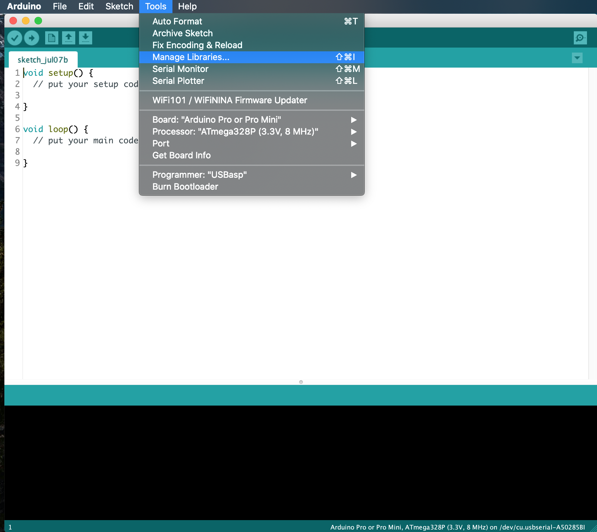
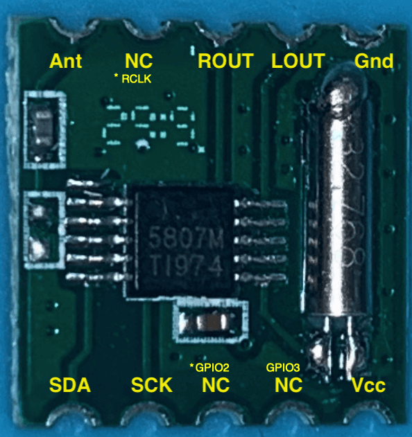
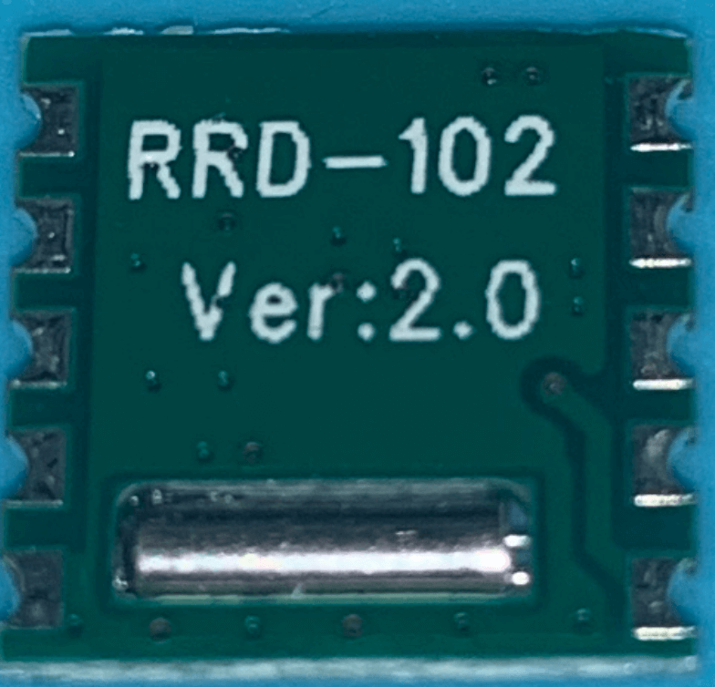
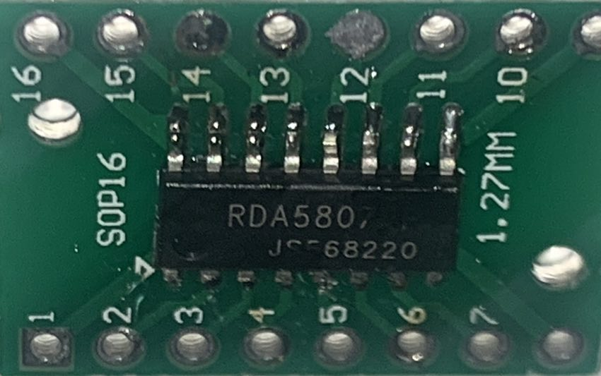
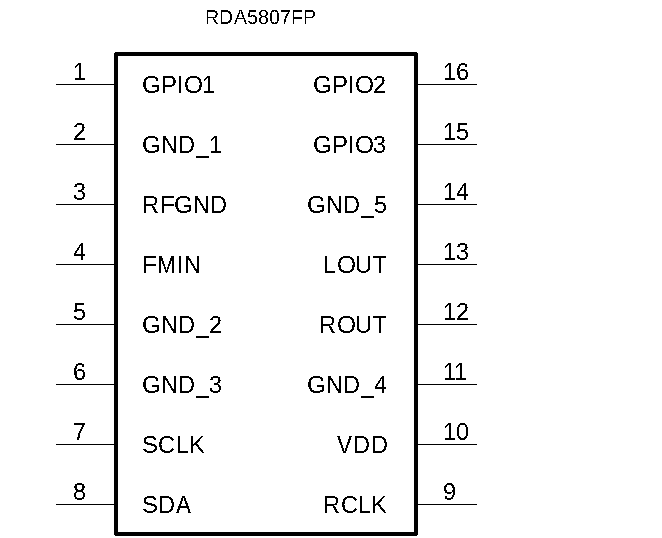
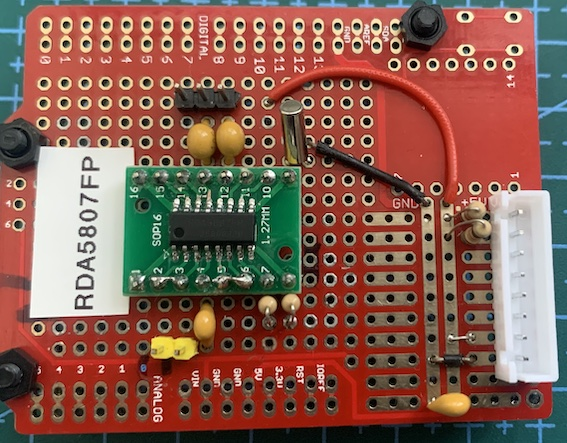
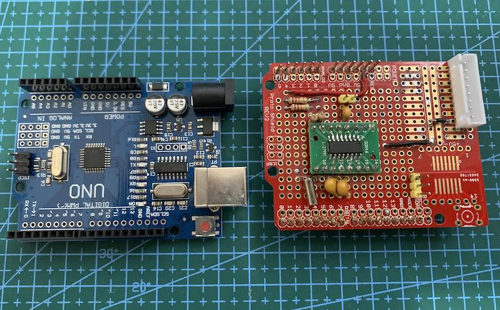
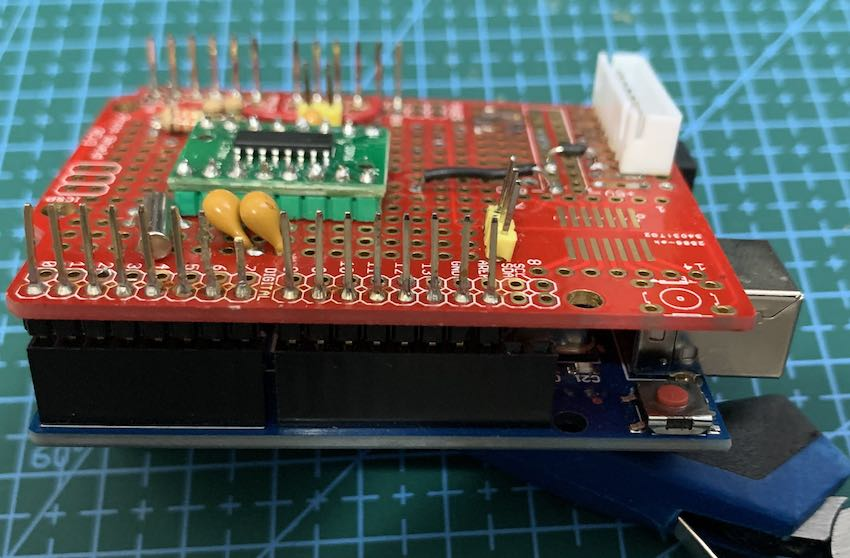
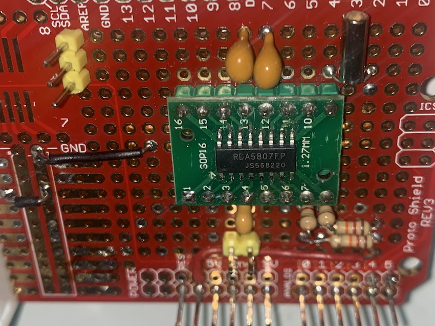
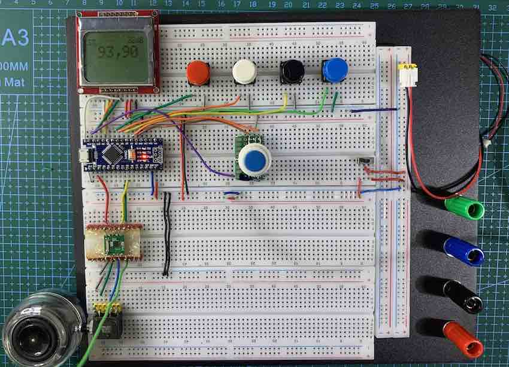

# [RDA5807 Arduino Library](https://pu2clr.github.io/RDA5807/)

It is a cross-platform Arduino Library for RDA5807 family device from RDA. You can use it with official Arduino boards, ATtiny, STM32 , ESP32 and more. It works with I2C protocol and can provide you an easier interface to control the RDA5807 device. This library was built based on "RDA microelectronics RDA5807MS - SINGLE-CHIP BROADCAST FM RADIO TUNER - Rev.1.1–Aug.2015" and RDA microelectronics RDA5807FP - SINGLE-CHIP BROADCAST FM RADIO TUNER. Please, be guided by the table of contents below to make the best use of this documentation.

This library can be freely distributed using the MIT Free Software model. It means you can copy, modify, merge, publish, distribute, sublicense, and/or sell copies of the Software. See [MIT License](https://pu2clr.github.io/RDA5807#mit-license) for more details.


[Copyright (c) 2019 Ricardo Lima Caratti](https://pu2clr.github.io/RDA5807/#mit-license). 

Contact: __pu2clr@gmail.com__.


## Contents

1. [Preface](https://pu2clr.github.io/RDA5807#preface)
2. [RDA5807 family devices and RDA5807 Arduino Library](https://pu2clr.github.io/RDA5807#rda5807-family-devices-and-rda5807-arduino-library)
4. [Library Installation](https://pu2clr.github.io/RDA5807#library-installation)
5. [Boards where this library has been tested](https://pu2clr.github.io/RDA5807#boards-where-this-library-has-been-tested)
5. [RDA5807M breakout](https://pu2clr.github.io/RDA5807#rda5807m-breakout)
6. [RDA5807FP standalone IC](https://pu2clr.github.io/RDA5807#rda5807fp-standalone-ic)
7. [API Documentation](https://pu2clr.github.io/RDA5807/extras/apidoc/html)
8. [MIT License](https://pu2clr.github.io/RDA5807#mit-license)
9. [Basic Schematic](https://pu2clr.github.io/RDA5807#schematic)
10. [All Schematics, photos and videos](extras/)
11. [Source code - Arduino Sketches](examples/)
12. [Videos about this library](https://pu2clr.github.io/RDA5807#videos-about-rda5807-and-this-arduino-library)


## Attention
* __The RDA5807 device can work safaty from 2.7 to 3.3V. Be aware that some Arduino board oparates with 5V instead of 3.3V (for example: Arduino Uno and Arduino Nano). A wrong setup can make the system unstable or damage the RDA5807 device__. Preferably use an Arduino or other boards like ESP32 and  ESP8266 that work with 3.3V voltage. If you are not using a 3.3V version of board, you must use a kind of 5V to 3.3V converter to feed the RDA5807 device and to send signal to  SCLK and SDIO/SDA pins.  In my experiments, I used an Arduino Nano (5V) and fed the RDA5807 with 3.3V (from the Nano. See the Pin 3.3V of the Arduino). It has worked. However, this is at your own risk.
 

## Preface 

The RDA5807 is a FM DSP integrated circuit receiver (50 to 115MHz) with low noise amplifier support. This device requires very few external components if compared with other similar devices. It also supports RDS/RBDS functionalities, direct auto gain control (AGC) and real time adaptive noise cancellation function. The PU2CLR RDA5807 Arduino Library was developed to take the most functionalities of this device. Knowing the functioning aspects of this receiver and sharing this knowledge were the main motivation for the development of this library. I hope this work will be useful for electronics experimenters and hobbyists. 

This documentation exposes the understanding of the author of this library about the functioning of the IC RDA5807 family. That said, it is possible that some information is not correct. If you find any wrong or inaccurate information, please let me know.

Please, check the [API Documentation](https://pu2clr.github.io/RDA5807/extras/apidoc/html/) for more details. 

## Your support is important.

If you want to support this library development, consider joining this project via Github. Alternatively, make suggestions on new features and report errors if you find them. Thank you!

There is a __Facebook__ group called [__DSP receivers for hobbyists__](https://www.facebook.com/groups/2655942598067211) where the purpose is exchanging experiences with projects based on RDA5807 IC devices.


## RDA5807 family devices and RDA5807 Arduino Library

This library has been successfully tested on RDA5807M and RDA5807FP devices. The videos below show some examples of using this library with RDA5807M and RDA5807FP.  




* [See the presentation video on youtube](https://youtu.be/eLWEWEjxM8U) 




* [See RDS and TFT Display example - youtube](https://youtu.be/PZsbqieeYns) 




* [See RDS and Nokia 5110 Display example - youtube](https://youtu.be/jInacTWoF9Y) 


## RDA5807 features implemented by this library

1. 76–108 MHz
2. Seek tuning
3. Automatic frequency control (AFC)
4. Automatic gain control (AGC)
5. Programmable de-emphasis (50/75 μs)
6. Adaptive noise suppression
7. Volume control
8. Mute control
9. Mono/Stereo control
10. RDS/RBDS Processor (under construction)
11. I2S Digital Audio (RDA5807FP)


You can buy the RDA5807 device on AliExpress, eBay, Amazon etc. You will find three types of RDA5807: The RDA5807MS, RDA5807M (breakout) and RDA5807FP (standalone IC).  


## Library Installation

 The easiest method to install this library is via your Arduino IDE. All you have to do is:
 
 1. Select Tools menu;
 2. Select Manage Libraries option;
 3. In the text box (top windows), type PU2CLR or RDA5807;
 4. Select the PU2CLR RDA5807. 


The images below show how you can install this library via your Arduino IDE from Manage Libraries tool.

<BR>



<BR>


### Installing via the repository 

With this approach, you will have the __most current version__ of the library. However, __it may not be the most stable version__. This is because the current version is always in development. [Prefer releases](https://github.com/pu2clr/RDA5807/releases). Do you need some old version (release) of this library?  If yes, [check here](https://github.com/pu2clr/RDA5807/releases).


First, you have to [download](https://github.com/pu2clr/RDA5807/archive/master.zip) this library in zip format.  
After, unzip the RDA5807-master.zip file in your Arduino Library folder. 

* On __Windows__: "My Documents\Arduino\libraries"
* On __MAC OS__: ˜/Documents/Arduino/libraries
* On __Linux__: ˜/home/Arduino/libraries


### Installing the most current version via arduino-cli

The commands below Install the latest version of the PU2CLR RDA5807 Arduino Library from github. 
As said before, unlike a release (installed from Arduino IDE) this method installs the current version of the PU2CLR RDA5807 Arduino Library (latest modifications even if not yet released).


#### On macOS or Linux

```bash
curl -fsSL https://raw.githubusercontent.com/arduino/arduino-cli/master/install.sh | sh
export ARDUINO_LIBRARY_ENABLE_UNSAFE_INSTALL=true
./bin/arduino-cli lib install --git-url https://github.com/pu2clr/RDA5807
```

#### On Windows 10 or 11

Run the command shell (cmd / Command Prompt) and follow the steps below.

```bash
echo off  
curl -fsSL https://downloads.arduino.cc/arduino-cli/arduino-cli_latest_Windows_64bit.zip --output arduinocli.zip
tar -xf arduinocli.zip 
set ARDUINO_LIBRARY_ENABLE_UNSAFE_INSTALL=true
.\arduino-cli lib install --git-url https://github.com/pu2clr/RDA5807
```

### How to use the RDA5807 Arduino Library in your sketch 

The following source-code snippet shows a common way of using the RDA5807 library in your application.
[Click here to know about all the functions integrated in this library](https://pu2clr.github.io/RDA5807/extras/apidoc/html/modules.html).

```cpp
#include <RDA5807.h>

RDA5807 rx;

void setup() {
    .
    .
    .
    // Start your receiver here
    rx.setup();
    rx.setVolume(6);
    rx.setFrequency(some_frequency); // Example 10390 for 103,9 MHz
    .
    .
    .
}

void loop() {
    //  Control your receiver here 
    .
    .
    .
}
```

<BR>

[See the folder examples do know more](https://github.com/pu2clr/RDA5807/tree/master/examples)

<BR>

## Boards where this library has been tested

This library can be useful to develop cross-platform software. So far, it has been successfully tested on the architectures shown below.  Please, pay attention to the pins used for I2C communication.  


|    | Board | Need voltage converter | I²C Pins | Features |
|--- | ----- | ---------------------- | -------- |  ------  |
|  1 | Arduino Pro Mini 3.3V 8MHz | No | A4 and A5 |  [More...](https://store.arduino.cc/usa/arduino-pro-mini) |
|  2 | Mega 2560 Pro | Yes | 20 and 21 | [More...](https://store.arduino.cc/usa/mega-2560-r3)|
|  3 | ESP WEMOS LOLIN32 | No | GPIO21 and GPIO22 [4] | [More...](https://docs.platformio.org/en/latest/boards/espressif32/lolin32.html) |
|  4 | ESP32 Dev Module | No | GPIO21 and GPIO22 [4] |  [More...](https://www.espressif.com/sites/default/files/documentation/esp32_datasheet_en.pdf) |
|  5 | ESP32 Wrover Module | No | GPIO21 and GPIO22 [4] |  [More...](https://www.espressif.com/sites/default/files/documentation/esp32-wrover_datasheet_en.pdf) |
|  6 | ESP8266 | No | GPIO4 and GPIO5 |   [More...](https://docs.ai-thinker.com/_media/esp8266/docs/esp-12f_product_specification_en.pdf) |
|  7 | Arduino UNO | Yes | A4 and A5 |  [More...](https://store.arduino.cc/usa/arduino-uno-rev3) |
|  8 | Arduino NANO ATmega 328 | Yes | A4 and A5 | [More...](https://store.arduino.cc/usa/arduino-nano) |
|  9 | Arduino NANO ATmega 168 | Yes | A4 and A5 | [More...](https://www.arduino.cc/en/uploads/Main/ArduinoNanoManual23.pdf) |
| 10 | Arduino NANO 33 IoT | No [6] | A4 and A5 | [More...](https://www.arduino.cc/en/Guide/NANO33BLE) |
| 11 | Arduino Yún / ATmega-32u4 | Yes | 2 and 3 | [More...](https://store.arduino.cc/usa/arduino-yun)|
| 12 | ATtiny84 | No | 7 and 8 | [More...](http://ww1.microchip.com/downloads/en/devicedoc/Atmel-7701_Automotive-Microcontrollers-ATtiny24-44-84_Datasheet.pdf)|
| 13 | ATtiny85 | No | 5 and 7 | [More...](https://ww1.microchip.com/downloads/en/DeviceDoc/Atmel-2586-AVR-8-bit-Microcontroller-ATtiny25-ATtiny45-ATtiny85_Datasheet.pdf)|
| 14 | Arduino DUE | No | 2 and 3 |  [More...](https://store.arduino.cc/usa/due) |
| 15 | BlueDuino 3.3V (ATmega-32u4) | No | 2 and 3 | [More...](https://wiki.aprbrother.com/en/BlueDuino_rev2.html) |
| 16 | Arduino Mini Pro 5V 16Mhz | Yes | 2 and 3 |  [More...](https://store.arduino.cc/usa/arduino-pro-mini) |
| 17 | STM32F746G-DISCO | No | - | [More...](https://www.st.com/en/evaluation-tools/32f746gdiscovery.html?fbclid=IwAR2D9OwhInHQ8WYxeflJQ7QV2aNscFbfcbeblaFcYq0angJIjCKmkQBPTBc) |
| 18 | STM32F103 Series  |  No | PB6 (SCL) and PB7(SDA) |  [More...](https://circuitdigest.com/microcontroller-projects/getting-started-with-stm32-development-board-stm32f103c8-using-arduino-ide) |
| 19 | STM32F411 Series  |  No | PB6 (SCL) and PB7(SDA) |  [More...](https://hackaday.com/2021/01/20/blue-pill-vs-black-pill-transitioning-from-stm32f103-to-stm32f411/) |
| 20 | Raspberry Pi Pico  | No | GP0 (0) and GP1 (1) |  [More...](https://www.tomshardware.com/how-to/program-raspberry-pi-pico-with-arduino-ide) | 
| 21 | WeAct Studio RP2040 Pico  | No | GP0 (0) and GP1 (1) |  [More...](https://productreview.click/shop/raspberry-pi-pico-board-rp2040-2mb-4mb-8mb-16mb-support-micropython-c-c、circuitpython/) | 
| 22 | Seeeduino XIAO | No  | A4 and A5  |  [More...](https://wiki.seeedstudio.com/Seeeduino-XIAO/)  | 
| 23 | Teensy 3.1     | No  | A4 and A5  |  [More...](https://www.pjrc.com/teensy/teensy31.html) | 
| 24 | Teensy 4.1     | No  | A4 and A5  |  [More...](https://www.pjrc.com/store/teensy41.html) | 
| 25 | Atmega8        | No  | PC4 and PC5 | [More...](https://github.com/MCUdude/MightyCore) |
| 26 | Atmega32       | No  | PC1 and PC0 | [More...](https://github.com/MCUdude/MightyCore) |
| 27 | Atmega128      | No  | PC1 and PC0 | [More...](https://ww1.microchip.com/downloads/en/DeviceDoc/doc2467.pdf) |
| 28 | LGT8F328P      | No  |  A4 and A5 |  [More...](https://ett.co.th/prodAVR/NANO-F328-C/LGT8F328P.pdf) |
| 29 | LUATOS ESP32C3 | No  |  GPIO4 and GPIO5 | [More...](https://templates.blakadder.com/luatos_CORE-ESP32.html) |


1. More about ESP boards on [ESPRESSIF Development Boards](https://www.espressif.com/en/products/hardware/development-boards).
2. More about BlueDuino on [Seed](https://www.seeedstudio.com/Blueduino-Rev2-Arduino-compatible-pius-BLE-CC2540-p-2550.html).
3. On [Arduino.cc](https://www.arduino.cc/) you can see the technical specification about many board. 
4. It seams that in some ESP32 board, the I²C bus is not configured properly by default. However, you can set almost any pin on ESP32 to setup I²C capabilities. All you have to do is call __Wire.begin(SDA, SCL);__ where SDA and SCL are the ESP32 GPIO pins. See the folder examples to check how to use ESP32 devices. 
5. Arduino Nano 33 BLE only supports 3.3V I/Os and is NOT 5V tolerant so please make sure you are not directly connecting 5V
signals to this board or it will be damaged. Also, as opposed to Arduino Nano boards that support 5V operation, the 5V pin does NOT
supply voltage but is rather connected, through a jumper, to the USB power input.


<BR>

## RDA5807M breakout

The photos below show a Breakout that uses the RDA5807M. 

##### Front side 


### Back side



* Judging by some documentations found on the Internet, some breakouts based on RDA5807M have GPIO2, GPIO3 and RCLK functions. Judiging by the "RDA microelectronics RDA5807MS - SINGLE-CHIP BROADCAST FM RADIO TUNER - Rev.1.1–Aug.2015", the RDA5807MS pinout does not have these functions. These documentations is still not clear to the author of this library. So, if you want to use the GPIO features of the RDA5807 architecture, please, prefer the RDA5807FP device (see it below). 


<BR>

## RDA5807FP standalone IC

If you are using the standalone RDA5807FP you must add some parts to make it work.  In my opinion, there is no big  reasons to use the RDA5807FP instead of the RDA5807M breakout in most applications. I think the most important situations are the possibility to use the digital audio configuration via I2S protocol or GPIO setup (Stereo indicator, interrupt etc). This library has function to deal with I2S and GPIO.

The photo below shows the RDA5807FP on a SOP16 board adapter. 

 


### RDA5807FP PINOUT

The image below shows the RDA5807FP pinout.     



<BR>

|  PIN     |  Label    |  Description      |
| -------- | --------- | ----------------- |
|    1     |  GPIO1    | General purpose input/output  | 
|    2     |  GND_1    | Ground. Must be connected to ground |
|    3     |  RFGND    | RF Ground. Must be connected to the ground or a special RF ground |
|    4     |  FMIN     | FM signal input - Antenna |
|    5     |  GND_2    | Ground. Must be connected to ground | 
|    6     |  GND_3    | Ground. Must be connected to ground |
|    7     |  SCLK     | I2C clock | 
|    8     |  SDA      | I2C SDA/SDIO |
|    9     |  RCLK     | 32.768kHz pasive crystal | 
|   10     |  VDD      | 3.3V power supply |
|   11     |  GND_4    | Ground. Must be connected to ground |
|   12     |  ROUT     | Right audio output |
|   13     |  LOUT     | Left audio output |
|   14     |  GND_5    | Ground. Must be connected to ground |
|   15     |  GPIO3    | General purpose input/output and stereo indicator  |
|   16     |  GPIO2    | General purpose input/output  |


The two photos below shows the standalone RDA5807FP IC mounted on a homebrew board.




<BR>


<BR> 

The schematic below shows the basic RDA5807FP setup. 


| Components |  Value | 
| ---------- | ------ |
| R1         |  1K    |
| R2         |  1K    |
| R3         |  8 ~ 12K   |
| R4         |  8 ~ 12K   |
| C1         |  1nF  (FMIN) |
| C2 and C3  |  4,7 ~ 10uF tantalum capacitor (stereo audio output) |      
| Q1         |  32768 kHz passive crystal oscillator |
| J1         |  Audio stereo jack |


### The RDA5807FP on an Arduino Uno adapter


The photos below show the RDA5807FP setup on a Arduino Uno board adapter.













* [See the presentation video on youtube](https://youtu.be/I7-fCKPDF4Y) 


<BR>


## MIT License 

Copyright (c) 2019 Ricardo Lima Caratti

Permission is hereby granted, free of charge, to any person obtaining a copy of this software and associated documentation files (the "Software"), to deal in the Software without restriction, including without limitation the rights to use, copy, modify, merge, publish, distribute, sublicense, and/or sell copies of the Software, and to permit persons to whom the Software is furnished to do so, subject to the following conditions:

The above copyright notice and this permission notice shall be included in all copies or substantial portions of the Software.

THE SOFTWARE IS PROVIDED "AS IS", WITHOUT WARRANTY OF ANY KIND, EXPRESS OR IMPLIED, INCLUDING BUT NOT LIMITED TO THE ARRANTIES OF MERCHANTABILITY, FITNESS FOR A PARTICULAR PURPOSE AND NONINFRINGEMENT. IN NO EVENT SHALL THE AUTHORS OR COPYRIGHT HOLDERS BE LIABLE FOR ANY CLAIM, DAMAGES OR OTHER LIABILITY, WHETHER IN AN ACTION OF CONTRACT, TORT OR OTHERWISE, ARISING FROM, OUT OF OR IN CONNECTION WITH THE SOFTWARE OR THE USE OR OTHER DEALINGS IN THE SOFTWARE.


<BR>

## Schematic

The circuits below can help you to connect the arduino based board to the RDA5807 version you are using.  In general, the RDA5807 can be found in kit or breakout form on Aliexpress, Amazon, eBay etc. 

### RDA5807M Breakout setup


### RDA5807M standalone IC setup (without breakout)


### RDA5807FP standalone IC setup 


### Arduino UNO, Pro mini or other based on ATmega 328 wireup.


| RDA5807 / Description |  Arduino Pin  |
| --------------------- | ------------  |
| VCC                   |   3.3V        |
| SDA / SDIO            |     A4        |
| SCL / SCLK            |     A5        |


### Arduino, TFT7735 display and Push Buttons wireup.


#### Arduino UNO, Nano or other based on Atmega328 and SPI TFT ST7735 1.8" wireup


| Device name       | Device Pin / Description  |  Arduino Pin  |
| ----------------  | --------------------      | ------------  |
| Display TFT       |                           |               |
|                   | RST (RESET)               |      8        |
|                   | RS  or DC                 |      9        |
|                   | CS  or SS                 |     10        |
|                   | SDI                       |     11        |
|                   | CLK                       |     13        |
|     RDA5807       |                           |               |
|                   | VCC                       |     3.3V      | 
|                   | SDIO (pin 8)              |     A4        |
|                   | SCLK (pin 7)              |     A5        |
|     Buttons       |                           |               |
|                   | Volume Up                 |      4        |
|                   | Volume Down               |      5        |
|                   | Stereo/Mono               |      6        |
|                   | RDS ON/off                |      7        |
|                   | SEEK (encoder button)     |     A0/14     |
|    Encoder        |                           |               |
|                   | A                         |       2       |
|                   | B                         |       3       |


## RDA5807 breakout, ATtiny84, Encoder and Buttons schematic


### RDA5807 breakout, ATtiny84, Encoder and Buttons  wireup  

<BR>

| RDA5807 pin     | Attiny84 REF pin | Physical pin  | 
| ----------------| -----------------| ------------- | 
| SEEK_UP         |     3            |    10         | 
| SEEK_DOWN       |     5            |     8         |
| ENCODER_PIN_A   |     0            |    13         |
| ENCODER_PIN_B   |     1            |    12         |  
| SDIO / SDA      |     SDA          |     7         |
| SCLK / CLK      |     SCL          |     9         |


### RDA5807 breakout, Arduino Nano and Nokia 5110 display wireup


| Device name               | Nokia 5110                |  Arduino      |
| --------------------------| --------------------      | ------------  |
| NOKIA 5110                | Pin function              |  Nano Pin     |
|                           | (1) RST (RESET)           |     8         |
|                           | (2) CE or CS              |     9         |
|                           | (3) DC or DO              |    10         |
|                           | (4) DIN or DI or MOSI     |    11         |
|                           | (5) CLK                   |    13         |
|                           | (6) VCC  (3V-5V)          |    +VCC       |
|                           | (7) BL/DL/LIGHT           |    +VCC       |
|                           | (8) GND                   |    GND        |
| --------------------------| ------------------------- | --------------|
| RDA5807                   |       Pin Function        |               | 
|                           | VCC                       |   3.3V        | 
|                           | SDIO (pin 8)              |     A4        |
|                           | SCLK (pin 7)              |     A5        |
| --------------------------| --------------------------| --------------|
| Buttons                   |                           |               |
|                           | Volume Up                 |      4        |
|                           | Volume Down               |      5        |
|                           | Stereo/Mono               |      6        |
|                           | RDS ON/off                |      7        |
|                           | SEEK (encoder button)     |     A0/14     |
| --------------------------| --------------------------|---------------| 
| Encoder                   |                           |               |
|                           | A                         |       2       |
|                           | B                         |       3       |


<BR>

### Arduino Nano, RDA5807 and Nokia 5110 setup  on Breadboard





### RDA5807 breakout, Arduino Nano and LCD16X02 display wireup


<BR>


| Device name               | Device Pin / Description  |  Arduino Pin  |
| --------------------------| --------------------      | ------------  |
|    LCD 16x2 or 20x4       |                           |               |
|                           | D4                        |     D7        |
|                           | D5                        |     D6        |
|                           | D6                        |     D5        |
|                           | D7                        |     D4        |
|                           | RS                        |     D12       |
|                           | E/ENA                     |     D13       |
|                           | RW & VSS & K (16)         |    GND        |
|                           | A (15) & VDD              |    +Vcc       |
| --------------------------| ------------------------- | --------------|
| RDA5807                   |                           |               | 
|                           | VCC                       |   3.3V        | 
|                           | SDIO (pin 8)              |     A4        |
|                           | SCLK (pin 7)              |     A5        |
| --------------------------| --------------------------| --------------|
| Buttons                   |                           |               |
|                           | Volume Up                 |      8        |
|                           | Volume Down               |      9        |
|                           | Stereo/Mono               |     10        |
|                           | RDS ON/off                |     11        |
|                           | SEEK (encoder button)     |     D14/A0    |
| --------------------------| --------------------------|---------------| 
| Encoder                   |                           |               |
|                           | A                         |       2       |
|                           | B                         |       3       |


### RDA5807FP setup, ESP32 and LCD16X02 display wireup


<BR>

Wire up ESP32 Dev Module, RDA5807 and LCD16x02 or LCD16x04

| Device name               | Device Pin / Description  |  Arduino Pin  |
| --------------------------| --------------------      | ------------  |
|    LCD 16x2 or 20x4       |                           |               |
|                           | D4                        |  GPIO18       |
|                           | D5                        |  GPIO17       |
|                           | D6                        |  GPIO16       |
|                           | D7                        |  GPIO15       |
|                           | RS                        |  GPIO19       |
|                           | E/ENA                     |  GPIO23       |
|                           | RW & VSS & K (16)         |  GND          |
|                           | A (15) & VDD              |  +Vcc         |
| --------------------------| ------------------------- | --------------|
| RDA5807FP (See schematic) |                           |               | 
|                           | VCC                       |  3.3V         |
|                           | SDIO / SDA (pin 8)        |  GPIO21       |
|                           | SCLK (pin 7)              |  GPIO22       |
| Buttons                   |                           |               |
|                           | Volume Up                 |  GPIO32       |
|                           | Volume Down               |  GPIO33       |
|                           | Stereo/Mono               |  GPIO25       |
|                           | RDS On/Off                |  GPIO26       |
| --------------------------| --------------------------| --------------|
| Encoder                   |                           |               |
|                           | A                         |  GPIO13       |
|                           | B                         |  GPIO14       |
|                           | PUSH BUTTON (encoder)     |  GPIO27       |


ATTENTION: Be guided by the ESP32 IO/GPIO pins. 


# Thanks

* I would like to thanks to __Dimitri, F5SWB__, for sharing his project based on RDA5807 (RDA5807 fm chipset / arduino with a Nextion screen F5SWB@2021 / Version 1.18). See [RDA5807](https://github.com/f5swb/RDA5807) 


# TO DO

* RDS Improvments;
* Example using OLED;
* Check the functions/methods to deal with I2S (RDA5807FP);
* Fix the problem with 200 kHz frequency step


### See also

* [PU2CLR Si4735 Library for Arduino](https://pu2clr.github.io/SI4735/). This library was built based on “Si47XX PROGRAMMING GUIDE; AN332” and it has support to FM, AM and SSB modes (LW, MW and SW). It also can be used on all members of the SI47XX family respecting, of course, the features available for each IC version;
* [PU2CLR SI4844 Arduino Library](https://pu2clr.github.io/SI4844). This is an Arduino library for the SI4844, BROADCAST ANALOG TUNING DIGITAL * DISPLAY AM/FM/SW RADIO RECEIVER,  IC from Silicon Labs.  It is available on Arduino IDE. This library is intended to provide an easier interface for controlling the SI4844.
* [PU2CLR AKC695X Arduino Library](https://pu2clr.github.io/AKC695X/). The AKC695X is a family of IC DSP receiver from AKC technology. The AKC6955 and AKC6959sx support AM and FM modes. On AM mode the AKC6955 and AKC6959sx work on LW, MW and SW. On FM mode they work from 64MHz to 222MHz.
* [PU2CLR KT0915 Arduino Library](https://pu2clr.github.io/KT0915/). The KT0915 is a full band AM (LW, MW and SW) and FM DSP receiver that can provide you a easy way to build a high quality radio with low cost.
* [PU2CLR BK108X](https://pu2clr.github.io/BK108X/). The BK1086 and BK1088 are DSP receivers from BAKEN. The BK1088 is a BROADCAST FM and AM (LW, MW and ) RECEIVER and BK1086 is a subset of the BK1088 (it does not have LW and SW acording to the Datasheet).
* [PU2CLR RDA5807 Arduino Library](https://pu2clr.github.io/RDA5807/). The RDA5807 is a FM DSP integrated circuit receiver (50 to 115MHz) with low noise amplifier support. This device requires very few external components if compared with other similar devices. It also supports RDS/RBDS functionalities, direct auto gain control (AGC) and real time adaptive noise cancellation function.
* [PU2CLR SI470X Arduino Library](https://pu2clr.github.io/SI470X/). It is a Silicon Labs device family that integrates the complete functionalities for FM receivers, including RDS (Si4703).
* [PU2CLR MCP23008](https://pu2clr.github.io/MCP23008/). It is an Arduino Library to control the MCP23008/MCP23S08 8-Bit I/O Expander. The MCP23008 device provides 8-bit, general purpose, parallel I/O expansion. It can be controlled via I2C bus applications. It is a great and inexpensive device that allow you to add more devices to be controlled by your Arduino board via I2C protocol.
* [PU2CLR - PCF8574 Arduino Library](https://pu2clr.github.io/PCF8574/). It is an Arduino Library to control the PCF8574 8-Bit I/O Expander. The PCF8574 device provides 8-bit, general purpose, parallel I/O expansion. It can be controlled via I²C bus applications. It is a great and inexpensive device that allow you to add more peripherals to be controlled by your Arduino board via I²C protocol.

### More Arduino Projects developed by author 

* [Multipurpose signal generator with SI5351](https://pu2clr.github.io/SI5351/). It is a multipurpose signal generator controlled by Arduino. This project uses the SI5351 from Silicon Labs. The Arduino sketch is configured to control the SI5351 with three channels from 32.768KHz to 160MHz and steps from 1Hz to 1MHz.
* [Shortwave Arduino Transmitter](https://pu2clr.github.io/Small-Shortwave-Transmitter/). This project is about a shortwave transmitter from 3 MHz to 30 MHz. It uses the SI5351 oscillator from Silicon Labs controlled by Arduino. Also, you can use it with a crystal oscillator. In this case, you will not need the SI5351 device and Arduino. 
* [Android and iOS Bluetooth Remote Control for PU2CLR Arduino Library DSP receivers](https://pu2clr.github.io/bluetooth_remote_control/). This project is an extension of the Arduino library projects for: [SI4735](https://pu2clr.github.io/SI4735/); [AKC6959](https://pu2clr.github.io/AKC695X/) and [KT0915](https://pu2clr.github.io/KT0915/). It is a simple example that shows a way to use your smartphone as a remote control via Bluetooth. In order to follow the steps presented here, I am assuming that you have some knowledge in development for mobile devices. Also, you will need to be familiar with the Javascript programming language. The development environment used by this project is the [Apache Cordova](https://cordova.apache.org/docs/en/latest/guide/overview/index.html). Cordova is a open-source mobile development framework that allows you to develop cross-platform applications. That means you can code once and deploy the application in many system, including iOS and Android. 
Cordova provides an easy way to develop for iOS and Android.  
* [Band Pass Filter controlled by Arduino](https://pu2clr.github.io/auto_bpf_arduino/). It is a HF band pass filter controlled by Arduino. It is designed for HF receivers. With this project, you can use a set of up to four HF bandpass filters that can be selected by Arduino. To do that you will need just two digital Arduino pins.


# References 

* [RDA5807FP -SINGLE-CHIP BROADCAST FM RADIO TUNER - Rev.1.2–April.2012](https://opendevices.ru/wp-content/uploads/2015/10/RDA5807FP.pdf)
* [RDA5807M - SINGLE-CHIP BROADCAST FM RADIO TUNER - Rev.1.1–Aug.2015](https://datasheet.lcsc.com/szlcsc/RDA-Microelectronics-RDA5807MS_C167246.pdf)
* [pu2clr/PU2CLR RDA5807 on PlatformIO](https://registry.platformio.org/libraries/pu2clr/PU2CLR%20RDA5807)
* [Arduino RDA5807 收音机](https://oshwhub.com/yeseqaq/arduino-rda5807)
* [What is FM Receiver, How to build an Arduino FM Radio with RDA5807](https://www.seeedstudio.com/blog/2020/01/09/what-is-fm-receiver-how-to-build-an-arduino-fm-radio-with-rda5807/)
* [A small eagle library for popular RDA5807 Radio module](https://github.com/TigerBouli/RDA5807m-Module-)
* [FM Stereo Radio Module RDA5807M Wireless Module](https://epartners.co.nz/products/sp0806)
* [kandi X-RAY  RDA5807 Summary](https://kandi.openweaver.com/html/pu2clr/RDA5807)
* [ワイドFM　DSPラジオ （RDA5807M）を作ってみた](https://www.himeport.co.jp/private_blog/ワイドfm%E3%80%80dspラジオ-（rda5807m）を作ってみた/)


# Videos about RDA5807 and this Arduino Library 

* [FM RECEIVER AND I2S DIGITAL AUDIO WITH RDA5807FP AND MAX98357A](https://youtu.be/07017sfMYdY)
* [FM receiver with RDA5807, Arduino UNO and TM1638 seven-segment module](https://youtu.be/I7-fCKPDF4Y)
* [FM  / RDS receiver with RDA5807FP, ESP32  and LCD16x02](https://youtu.be/HgMEgd74SUk)
* [FM / RDS receiver with RDA5807, Arduino Nano and Nokia 5110 display](https://youtu.be/jInacTWoF9Y)
* [FM Receiver with PU2CLR RDA5807 Arduino Library and Nokia 5110](https://youtu.be/ZcgJT7MQdQc)
* [FM Receiver with PU2CLR RDA5807 Arduino Library - RDS/RBDS first test](https://youtu.be/PZsbqieeYns)
* [FM Receiver with RDA5807 Arduino Library by PU2CLR](https://youtu.be/eLWEWEjxM8U)
* [Receptor de FM SDR con RDA5807 - Spanish](https://youtu.be/6PAnqT2TrL8)
* [RDA5807 Fm based radio - Portuguese](https://youtu.be/2g1KJkDFCaU)
* [Rádio FM RDA5807 com ESP32, Arduino etc - Portuguese](https://www.dobitaobyte.com.br/radio-fm-rda5807-com-esp32-arduino-etc/?amp)
* [RDA5807 fm chipset / arduino with a Nextion screen F5SWB@2021 / Version 1.18](https://github.com/f5swb/RDA5807)  
* [Breadboard FM Radio with RDA5807 and WIO Terminal](https://youtu.be/ONZBhaCEMVM)
* [RDA5807 Real test demo](https://youtu.be/0PnV5YjpnV4)
* [Receptor FM RDA5807 y Arduin. de 50 a 115 Mhz Experimental](https://youtu.be/g7dwFqzRjV0)
* [[开源]基于Arduino nano和RDA5807的立体声收音机](https://www.bilibili.com/video/BV1yN411w7DC/)


