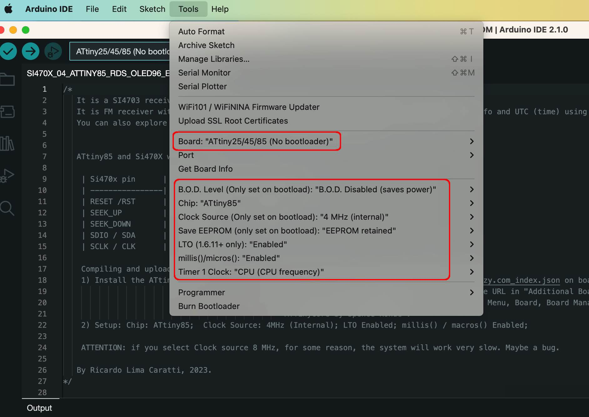
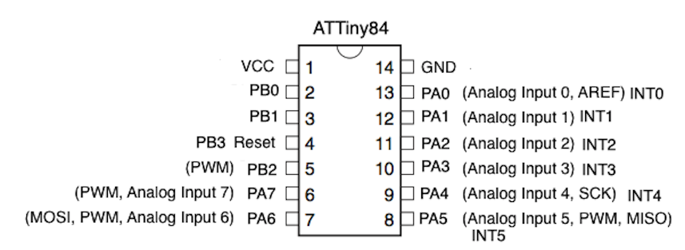

# ATTiny84 and ATTiny85 setup

It is possible to use the Arduino IDE platform with the PU2CLR SI470X Arduino Library to implement receivers with the ATTiny84 and ATTiny85. You will find details on how to do this below.


## Arduino IDE setup


* Open the Arduino IDE on your computer.
* Go to the "File" or "Arduino IDE" menu and select "Preferences".
* In the Preferences window, look for the "Additional Boards Manager URLs" field and click on the icon to edit it.
* Add the following URL to the field: [http://drazzy.com/package_drazzy.com_index.json](http://drazzy.com/package_drazzy.com_index.json)
* Click "OK" to close the Preferences window.
* Next, go to the "Tools" menu and select "Board" -> "Boards Manager".
* In the Boards Manager, type "attiny" in the search bar.
* Look for "ATTinyCore by Spence Konde" and click on the "Install" button next to it.
* Wait for the installation to complete.
* Once installed, you can close the Boards Manager.
* Now, go to the "Tools" menu and select "Board". You should see a new "ATTinyCore" section.
* Select the appropriate ATtiny microcontroller you are using, along with the desired clock speed and other options. 
* You are now ready to program and use ATtiny microcontrollers with the Arduino IDE using the AttinyCore. 
* Please note that the specific steps and menu options may vary slightly depending on the version of the Arduino IDE you are using. See image below.





[More details](https://github.com/SpenceKonde/ATTinyCore)


## Programming Interface (USBAsp 6 pin)


After installing ATTiny Core on Arduino IDE, connect USBASP following the steps below:
* Make sure your USBASP programmer is connected to your computer via USB.
* Connect the USBASP to the target ATTiny microcontroller using the appropriate connections (MISO, MOSI, SCK, RST, VCC, and GND). See tables below.
* Select the Board and Programmer:
* Go to "Tools" -> "Board" and select the ATTiny microcontroller you are using (e.g., ATTiny85).
* Go to "Tools" -> "Programmer" and select "USBasp."
* Compile the Sketch:
    * Write or open your Arduino sketch.
    * Go to "Sketch" -> "Verify/Compile" to compile the sketch for the selected ATTiny board.
    * Upload the Sketch:
    * Go to "Sketch" menu -> "Upload Using Programmer" or press Shift + Ctrl + U.
    * The Arduino IDE will compile the sketch and upload it to the ATTiny microcontroller using the USBASP programmer.
    * Verify the Upload.


The table below shows the pin functions of the ATTiny84 and ATTiny85  needed to upload sketch via USBAsp interface.


| Function / USBAsp   | ATTiny85 Pin |  ATTiny84 Pin | 
| ------------------- | ------------ | ------------- |
| RESET               | 1 (PB5)      | 4 (PB3)       |   
| MOSI                | 5 (PB0)      | 7 (PA6)       |
| MISO                | 6 (PB1)      | 8 (PA5)       |
| SCK                 | 7 (PB2)      | 9 (PA4)       |
| GND                 | 4            | 14            |
| VCC                 | 8            | 1             |


| Function / USBAsp   | ATTiny85 Pin |  ATTiny84 Pin | 
| ------------------- | ------------ | ------------- |
| RESET               | 1 (PB5)      | 4 (PB3)       |   
| MOSI                | 5 (PB0)      | 7 (PA6)       |
| MISO                | 6 (PB1)      | 8 (PA5)       |
| SCK                 | 7 (PB2)      | 9 (PA4)       |
| GND                 | 4            | 14            |
| VCC                 | 8            | 1             |


## ATTiny84 


### ATTiny84 wireup

| RDA5807 pin     | ATTiny84 REF pin | Physical pin  | 
| ----------------| -----------------| ------------- | 
| SEEK_UP         |     3            |    10         | 
| SEEK_DOWN       |     5            |     8         |
| ENCODER_PIN_A   |     0            |    13         |
| ENCODER_PIN_B   |     1            |    12         |  
| SDIO / SDA      |     SDA          |     7         |
| SCLK / CLK      |     SCL          |     9         |


### ATTiny84 pinout




## ATTiny85 


### ATTiny85 and RDA5807 wireup  

| RDA5807 pin     | ATTiny85 REF pin | Physical pin | 
| ----------------| -----------------| ------------- | 
| SEEK_UP         |     PB1          |     6         | 
| SEEK_DOWN       |     PB4          |     3         |
| AUDIO_MUTE      |     PB3          |     2         | 
| SDIO / SDA      |     SDA          |     5         |
| SCLK / CLK      |     SCL          |     7         |
   
<BR>

#### ATTiny85 pinout


#### The example below implements an FM receiver with RDS and audio mute functions.

```cpp
#include <RDA5807.h>
#include <EEPROM.h> // The ATTiny85 contains 512 bytes of data EEPROM memory. The EEPROM has an endurance of at least 100,000 write/erase cycles.
#include <Tiny4kOLED.h>
#define SEEK_UP   PB1     
#define SEEK_DOWN PB4  
#define AUDIO_MUTE PB3  
#define VALID_DATA 85
char *stationName;
uint16_t currentFrequency;
RDA5807 rx;
void setup()
{
  pinMode(SEEK_UP, INPUT_PULLUP);
  pinMode(SEEK_DOWN, INPUT_PULLUP);
  pinMode(AUDIO_MUTE, INPUT_PULLUP);
  oled.begin();
  oled.clear();
  oled.on();
  oled.setFont(FONT8X16);
  rx.setup();
  rx.setVolume(8);  
  // Restores the latest frequency and audio mute statis saved into the EEPROM
  if (EEPROM.read(0) == VALID_DATA ) {
    currentFrequency = EEPROM.read(1) << 8;
    currentFrequency |= EEPROM.read(2);
    rx.setMute(EEPROM.read(3));
  } else {
    currentFrequency = 10390; // default value
  } 
  rx.setFrequency(currentFrequency); 
  rx.setRDS(true);
  rx.setRdsFifo(true);
  showStatus();
}
void showStatus() {
  oled.setCursor(0, 0);
  oled.print(F("FM"));
  oled.setCursor(38, 0);
  oled.clearToEOL();
  oled.setCursor(38, 0);
  oled.print(rx.formatCurrentFrequency()); 
  oled.setCursor(95, 0);
  oled.print(F("MHz"));
  oled.setCursor(0, 2);
  oled.clearToEOL();
}
void loop()
{
  uint8_t  bkey;
  bkey = ((digitalRead(SEEK_UP) << 2) | (digitalRead(SEEK_DOWN) << 1)) | digitalRead(AUDIO_MUTE); // 3, 5 or 6 (considering just one button pressed)  
  if ( bkey != 0b111) { // if none of them is pressed (not igual to 0b011, 0b101 or 0b110) then do nothing.
    if (bkey == 0b011) // 3 
      rx.seek(RDA_SEEK_WRAP,RDA_SEEK_UP, showStatus);
    else if ( bkey == 0b101) // 5
      rx.seek(RDA_SEEK_WRAP,RDA_SEEK_DOWN, showStatus);
    else // 6 
      rx.setMute(!rx.isMuted()); // inverts the audio mute status  
    showStatus();
    delay(200);
    // Saves the current frequency if it has changed. 
    currentFrequency = rx.getFrequency();
    EEPROM.update(0, VALID_DATA); // Says that a valid frequency will be saved  
    EEPROM.update(1, currentFrequency  >> 8);   // stores the current Frequency HIGH byte 
    EEPROM.update(2, currentFrequency & 0xFF);  // stores the current Frequency LOW byte 
    EEPROM.update(3, rx.isMuted());
  }
  if ( rx.getRdsReady() &&  rx.hasRdsInfo() && rx.getRdsFlagAB() == 0 )  {
    stationName = rx.getRdsText0A();
    oled.setCursor(0, 2);
    if ( stationName != NULL ) 
        oled.print(stationName); 
    else 
      oled.clearToEOL();
    delay(70);
  }
  delay(5);
}
```


### Installing ATTiny Core in Arduino IDE 

The ATTiny core board/plataform can be installed using the Arduino IDE boards manager. 
Inserts the URL http://drazzy.com/package_drazzy.com_index.json on board manager. To do that, go to Preferences, enter the above URL in "Additional Boards Manager URLs. To setup ATTiny85 on Arduino IDE, go to Tools Menu, Board, Board Manager and install "ATTinyCore by Spence Konde". 

Board setup: Select Chip = ATTiny85;  Clock Source = 4MHz (Internal); LTO = Enabled; millis() / macros() = Enabled; 

ATTENTION: if you select Clock source 8 MHz, for some reason, the system will work very slow. Maybe a bug. Not sure. 

See [ATTiny Core - 1634, x313, x4, x41, x5, x61, x7, x8 and 828 for Arduino](https://github.com/SpenceKonde/ATTinyCore).

See also [ATTiny85 pinout](https://ww1.microchip.com/downloads/en/DeviceDoc/Atmel-2586-AVR-8-bit-Microcontroller-attiny25-attiny45-attiny85_Datasheet.pdf).


# References 

* [Programming ATTiny85 / 84 / 45 / 44 / 25 /24](https://wolles-elektronikkiste.de/en/programming-attiny85-84-45-44-25-24) 
[ ATTinyCore](https://github.com/SpenceKonde/attinyCore)
* [How To Program ATTiny13/ATTiny13a using Arduino IDE](https://www.electronics-lab.com/project/how-to-program-ATTiny13ATTiny13a-using-arduino-ide/)
* [](https://github.com/SpenceKonde/ATTinyCore)


