# Examples 


[This folder](https://github.com/pu2clr/RDA5807/tree/master/examples) has some examples that might help you to use the RDA5807 Arduino Library in your receiver project. If you find some error or problem during your implementation, please let me know. 

__This project is about a library to control the RDA5807 device and the focus of this project is the library and its functionalities. Please, don't ask me to assist you in your: displays, encoders, LED, buttons or something else out the library scope. Thanks.__

The examples stored in this folder are made to assist you to build your own sketch. Therefore, it is important to say that there was no care with the layout. This part of the project stays with you.


The [RDA5807_01_SERIAL_MONITOR](https://github.com/pu2clr/RDA5807/tree/master/examples/RDA5807_01_SERIAL_MONITOR) folder shows how you can check your circuit by using just the Arduino IDE Serial Monitor to control the receiver. Check the examples with Atmega328 and ESP32. __In the sketch you will find the wireup with Atmega328 or ESP32 and RDA5807 device__.  

The following table shows the main examples implemented in this library. These examples can guide you to build your own receiver.

| Sketch Name                     |  Description |
| ------------------------------- | ------------ |
| [RDA5807_00_CIRCUIT_TEST](https://github.com/pu2clr/RDA5807/tree/master/examples/RDA5807_01_SERIAL_MONITOR/RDA5807_00_CIRCUIT_TEST) | Useful to check the circuit and many functions implemented in this library |
| [RDA5807_00_MINIMAL_RECEIVER](https://github.com/pu2clr/RDA5807/tree/master/examples/RDA5807_02_MINIMAL_RECEIVER) | It is a minimal receicer with two push buttons (ATmega328 - Uno, Nano etc) |
| [RDA5807_01_SERIAL_MONITOR/ <BR> RDA5807_01_ALL_TEST_SERIAL_MONITOR](https://github.com/pu2clr/RDA5807/tree/master/examples/RDA5807_01_SERIAL_MONITOR/RDA5807_01_ALL_TEST_SERIAL_MONITOR) | More about Tune, Volume, Seek and RDS features |
| [RDA5807_01_SERIAL_MONITOR/ <BR> RDA5807_01_RDS_TEST_SERIAL_MONITOR](https://github.com/pu2clr/RDA5807/blob/master/examples/RDA5807_01_SERIAL_MONITOR/RDA5807_01_RDS_TEST_SERIAL_MONITOR/RDA5807_01_RDS_TEST_SERIAL_MONITOR.ino) | Test RDS functions  using Serial Monitor |
| [RDA5807_01_SERIAL_MONITOR/ <BR> RDA5807_02_ESP32](https://github.com/pu2clr/RDA5807/blob/master/examples/RDA5807_01_SERIAL_MONITOR/RDA5807_02_ESP32/RDA5807_02_ESP32.ino) | Test and validation of RDA5807 on ESP32 board |
| [RDA5807_01_SERIAL_MONITOR/ <BR> RDA5807_03_STM32](https://github.com/pu2clr/RDA5807/tree/master/examples/RDA5807_01_SERIAL_MONITOR/RDA5807_03_STM32) | Test and validation of RDA5807 on STM32 board |
| [RDA5807_02_TFT_display](https://github.com/pu2clr/RDA5807/tree/master/examples/RDA5807_02_TFT_display) |  This sketch uses an Arduino Pro Mini, 3.3V (8MZ) with a SPI TFT ST7735 1.8 |
| [RDA5807_03_ATTINY_84_85](https://github.com/pu2clr/RDA5807/tree/master/examples/RDA5807_03_ATTINY_84_85) | Test and validation of RDA5807 on ATtiny84 device |
| [RDA5807_04_NOKIA5110](https://github.com/pu2clr/RDA5807/tree/master/examples/RDA5807_04_NOKIA5110) | This sketch uses an Arduino Nano with NOKIA 5110 display | 
| [RDA5807_05_LCD16X02](https://github.com/pu2clr/RDA5807/tree/master/examples/RDA5807_05_LCD16X02) | This sketch uses an Arduino Nano with LCD16X02 DISPLAY |
| [RDA5807_05_LCD16X02_ESP32](https://github.com/pu2clr/RDA5807/tree/master/examples/RDA5807_05_LCD16X02_ESP32) | This sketch uses an ESP32 with LCD16X02 DISPLAY|
| [RDA5807_05_LCD16X02_ESP32_I2S](https://github.com/pu2clr/RDA5807/tree/master/examples/RDA5807_05_LCD16X02_ESP32_I2S) | I2S setup - This sketch uses an ESP32 with LCD16X02 DISPLAY and MAX98357A I2S setup |
| [RDA5807_06_UNO_TM1638](https://github.com/pu2clr/RDA5807/tree/master/examples/RDA5807_06_UNO_TM1638) | This sketch drives the RDA5807 FM receiver and TM1638 (seven-segment display control) |
| [Arduino Nano and OLED with Tiny4kOLED library](https://github.com/pu2clr/RDA5807/tree/master/examples/RDA5807_07_NANO_OLED)|  Nano and OLED implementation V1 | 
| [Arduino Nano and OLED (Adafruit_GFX and Adafruit_SSD1306)](https://github.com/pu2clr/RDA5807/tree/master/examples/RDA5807_07_NANO_OLED_V2) | This sketch works on Atmega328 and LGT8FX based board. It is a I2C OLED setup  | 
| [LilyGO/T-Embed and RDA5807 setup](https://github.com/pu2clr/RDA5807/tree/master/examples/RDA5807_08_LILYGO_T_EMBED)| This sketch was an adaptation of the Volos's sketch and uses PU2CLR RDA5807 Arduino Library with LilyGO T-Embed.  |


## Donate 

If you find this project useful, consider making a donation so that the author of this library can purchase components and modules for improvements and testing of this library. [Click here to donate.](https://www.paypal.com/donate/?business=LLV4PHKTXC4JW&no_recurring=0&item_name=Consider+making+a+donation.++So+I+can+purchase+components+and+modules+for+improvements+and+testing+of+this+library.&currency_code=USD)


## Examples and Schematics


### Basic circuit (examples  RDA5807_00_CIRCUIT_TEST and RDA5807_01_SERIAL_MONITOR)


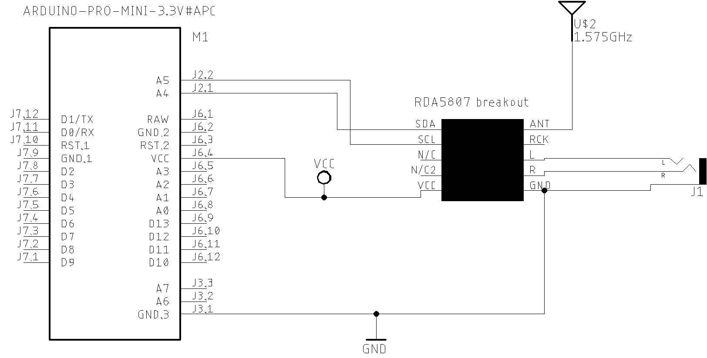


### Minimalist receiver based on RDA5807

The following code illustrates a minimalist implementation of a receiver based on RDA5807 and this library.
For this receiver, the user has two pushbuttons to tune station (Seek Up and Seek Down).


```cpp
#include <RDA5807.h> // It is a minimal receicer with two push buttons (ATmega328 - Uno, Nano etc)
RDA5807 rx; 
void setup() {
  pinMode(4, INPUT_PULLUP); // Arduino pin 4 - Seek station down
  pinMode(5, INPUT_PULLUP); // Arduino pin 5 - Seek station up
  rx.setup(); // Starts the receiver with default parameters
  rx.setFrequency(10390); // Tunes in 103.9 MHz  - Switch to your local favorite station
}
void loop() {
  if (digitalRead(4) == LOW) rx.seek(RDA_SEEK_WRAP,RDA_SEEK_DOWN);
  if (digitalRead(5) == LOW) rx.seek(RDA_SEEK_WRAP,RDA_SEEK_UP);
  delay(200);
}
```

#### Minimalist receiver based on RDA5807 circuit

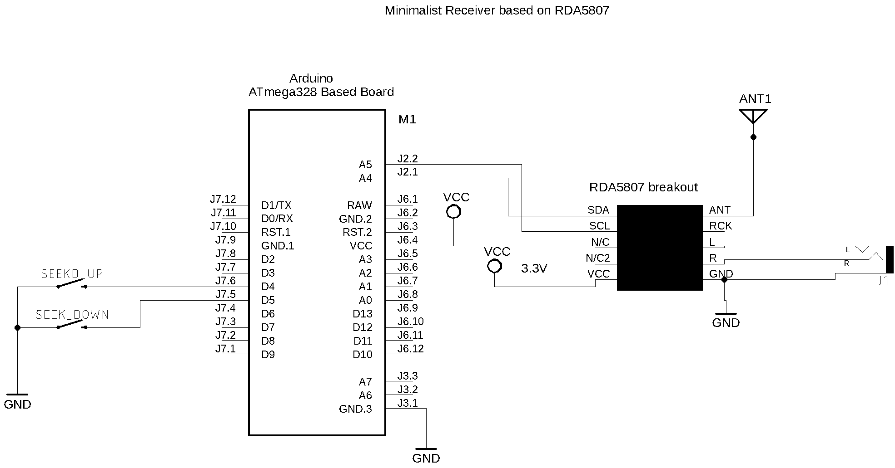


### TFT Display (example RDA5807_02_TFT_display)


### Attiny84 with OLED setup

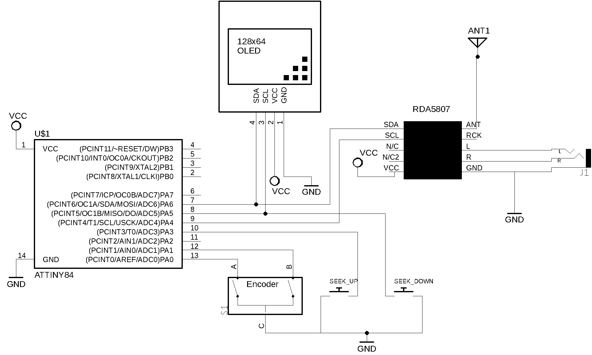


### Attiny85 with OLED setup

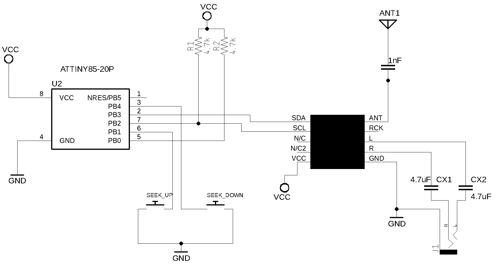




* [See the presentation video on youtube](https://youtu.be/eLWEWEjxM8U) 



* [See RDS and TFT Display example - youtube](https://youtu.be/PZsbqieeYns) 


### Arduino Nano and NOKIA5110 schematic


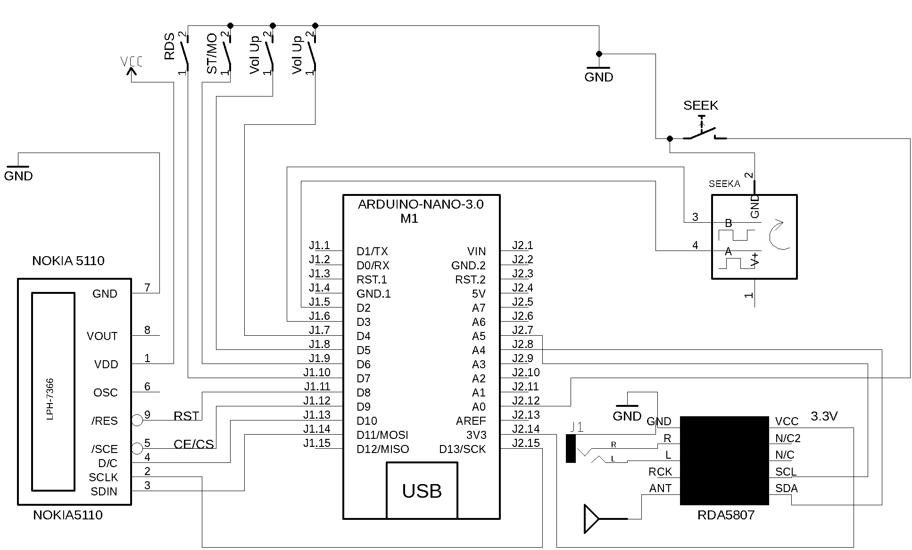

<BR>

[Source Code](https://github.com/pu2clr/RDA5807/tree/master/examples/RDA5807_04_NOKIA5110)




* [See RDS and Nokia 5110 Display example - youtube](https://youtu.be/jInacTWoF9Y) 


### Arduino Nano and LCD 16x02 


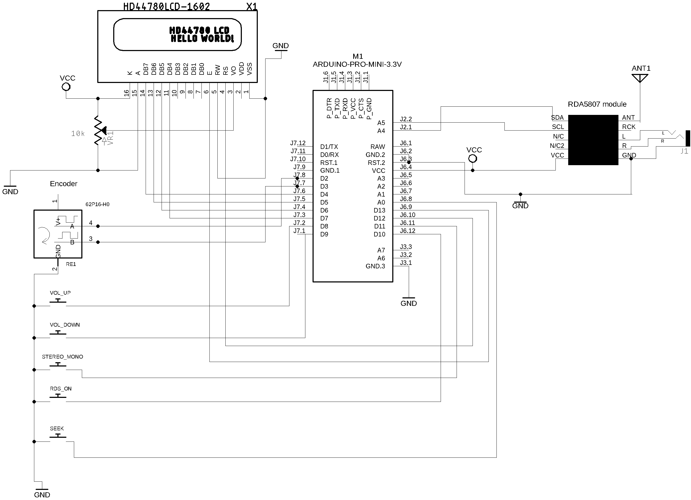

<BR>

[Source Code](https://github.com/pu2clr/RDA5807/tree/master/examples/RDA5807_05_LCD16X02)


### ESP32 and LCD 16x02 


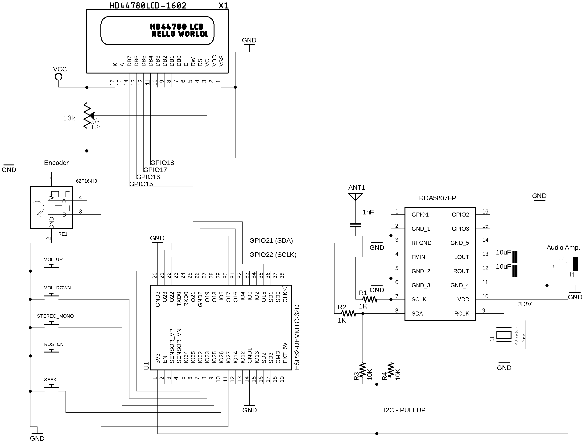

<BR>

[Source Code](https://github.com/pu2clr/RDA5807/tree/master/examples/RDA5807_05_LCD16X02_ESP32)




* [See RDS, ESP32 and LCD 16x02 on youtube](https://youtu.be/HgMEgd74SUk) 


### I2S and RDA5807FP Setup 


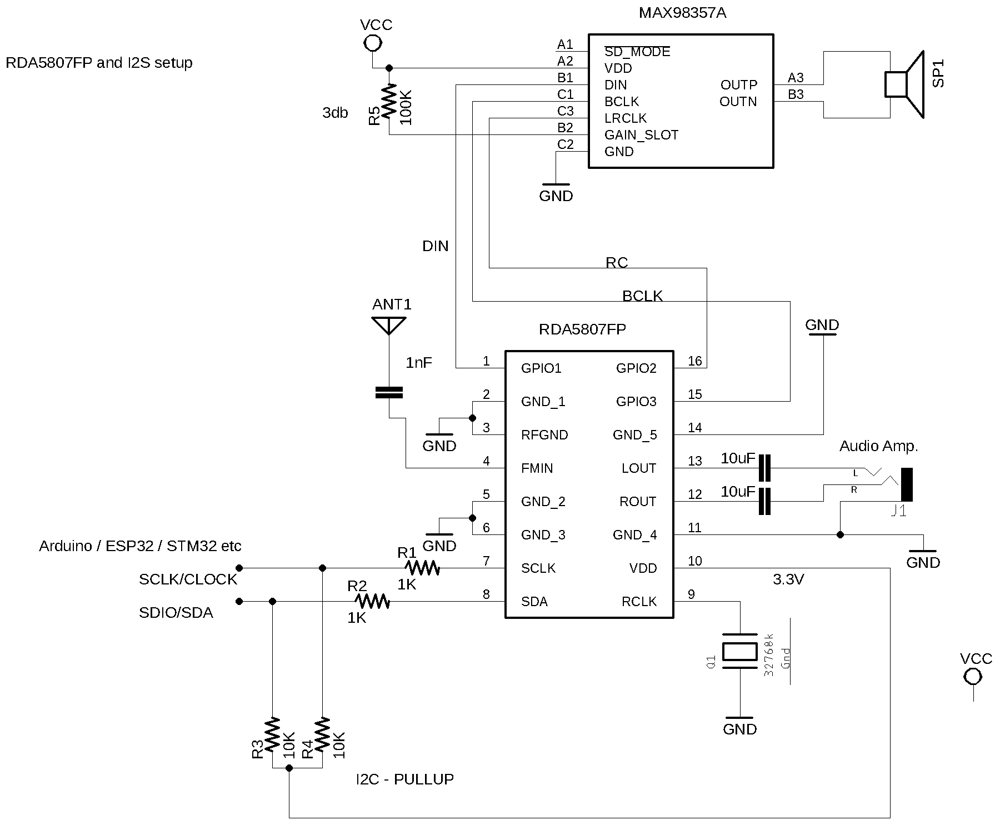




* [Video about the RDA5807FP and I2S Digital Audio setup](https://youtu.be/07017sfMYdY) 


The photo below show the DAC MAX98357A device

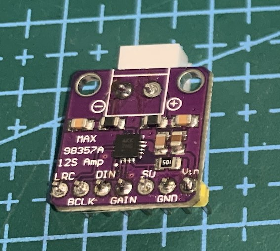

<BR>

[Source Code](https://github.com/pu2clr/RDA5807/tree/master/examples/RDA5807_05_LCD16X02_ESP32_I2S)


The table below shows the  MAX98357A device connected to the RDA5807FP.


  | RDA5807FP    | DAC MAX98357A  |
  |--------------| ---------------|
  | GPIO2        | DIN            |  
  | GPIO1        | RC             | 
  | GPIO3        | BCLK           |  


The photo below show the CJMCU-1334 module
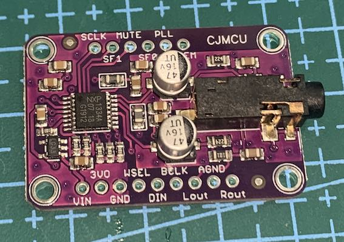


### Arduino UNO and display module TM1638


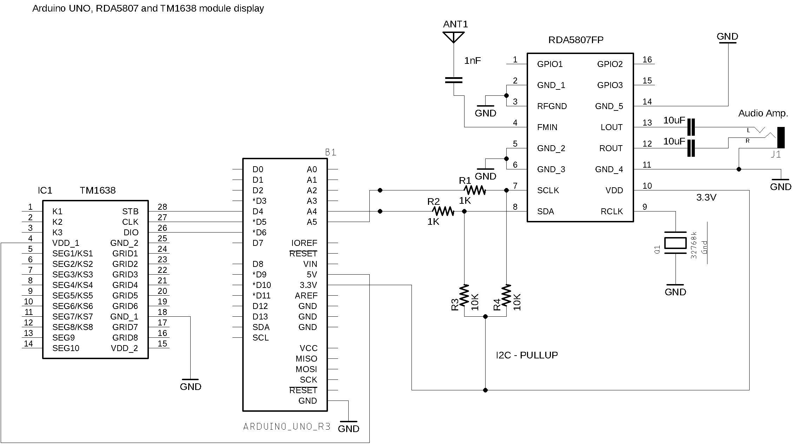


  Wire up on Arduino UNO, RDA5807 and TM1638

  | Device name               | Device Pin / Description      |  Arduino Pin  |
  | ----------------          | ----------------------------- | ------------  |
  |    TM1638                 |                               |               |
  |                           | STB                           |    4          |
  |                           | CLK                           |    5          |
  |                           | DIO                           |    6          |
  |                           | VCC                           |    3.3V       |
  |                           | GND                           |    GND        |
  |    RDA5807                |                               |               |
  |                           | SDIO (pin 18)                 |     A4        |
  |                           | SCLK (pin 17)                 |     A5        |
  |                           | SEN (pin 16)                  |    GND        |

  The TM1638 painel controls

  | TM1638 button |  Description                             | 
  | ------------- | ---------------------------------------- |
  | S1            | Increments the frequency (100kHz step)   |
  | S2            | Decrements the frequency (100kHz Down)   |
  | S3            | Seeks the next station available (The direction is defined by the last action of frequency changing) |
  | S4            | Increments the audio volume |
  | S5            | Decrements the audio volume |
  | S6            | Turnn the audio On or Off |
  | S7            | Sets the Stereo On or Off |
  | S8            | Toggles Bass on or off) |




* [See the presentation video about Arduino UNO and display module TM1638 on youtube](https://youtu.be/I7-fCKPDF4Y) 


## Examples of third parties 

* [Receptor de FM SDR con RDA5807 - Spanish](https://youtu.be/6PAnqT2TrL8)
* [RDA5807 Fm based radio - Portuguese](https://youtu.be/2g1KJkDFCaU)
* [Rádio FM RDA5807 com ESP32, Arduino etc - Portuguese](https://www.dobitaobyte.com.br/radio-fm-rda5807-com-esp32-arduino-etc/?amp) 
* [RDA5807M - SINGLE-CHIP BROADCAST FMRADIO TUNER](https://www.electrodragon.com/w/images/5/5f/RDA5807M_datasheet_v1.pdf)
* [A small eagle library for popular RDA5807 Radio module](https://github.com/TigerBouli/RDA5807m-Module-)
* [RDA5807 fm chipset / arduino with a Nextion screen F5SWB@2021 / Version 1.18](https://github.com/f5swb/RDA5807)
* [Breadboard FM Radio with RDA5807 and WIO Terminal](https://youtu.be/ONZBhaCEMVM)
* [RDA5807 Real test demo](https://youtu.be/0PnV5YjpnV4)
* [Receptor FM RDA5807 y Arduin. de 50 a 115 Mhz Experimental](https://youtu.be/g7dwFqzRjV0)
  

