# Extras

Here you will find all schematics used by the examples sketches, the EAGLE files and photos. 

## Some homebrew boards 

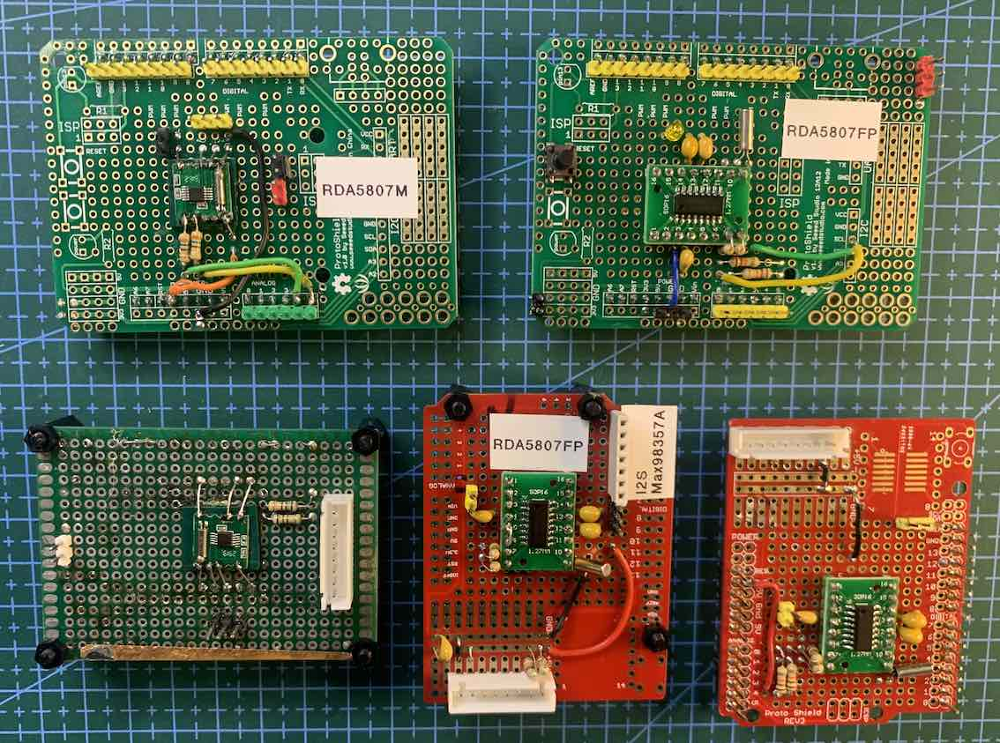

### Arduino UNO board adapters (Left RDA5707M and right RDA5807FP)

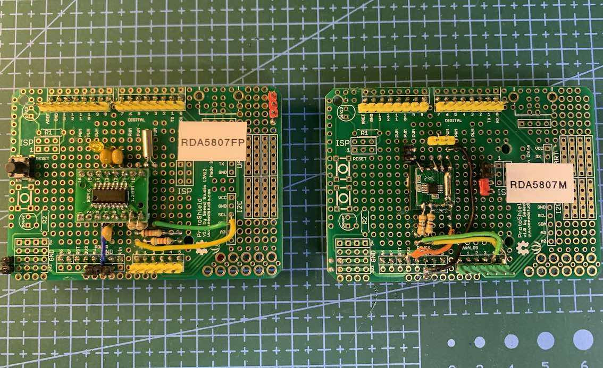

#### Arduino Uno and RDA5807M homebrew adapter board 

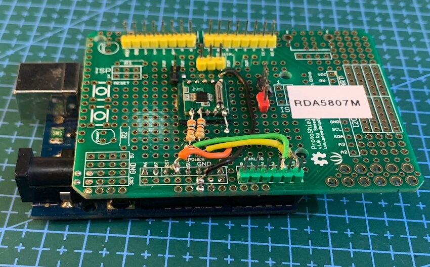

## All Schematics 

### RDA5807M Breakout setup

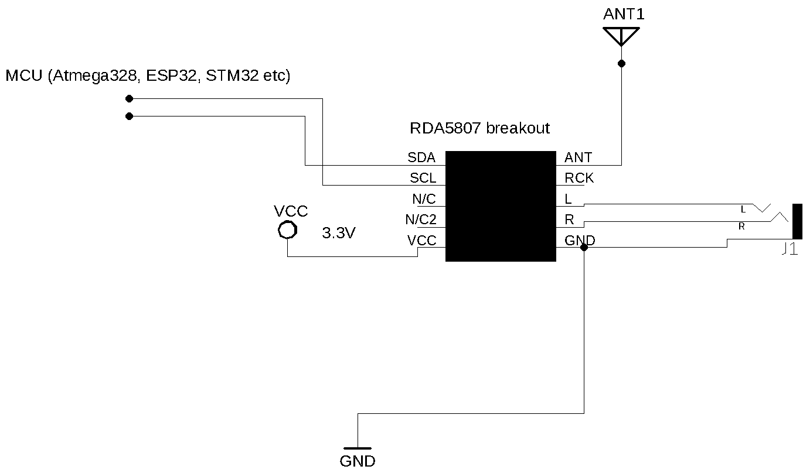

### RDA5807M standalone IC setup (without breakout)

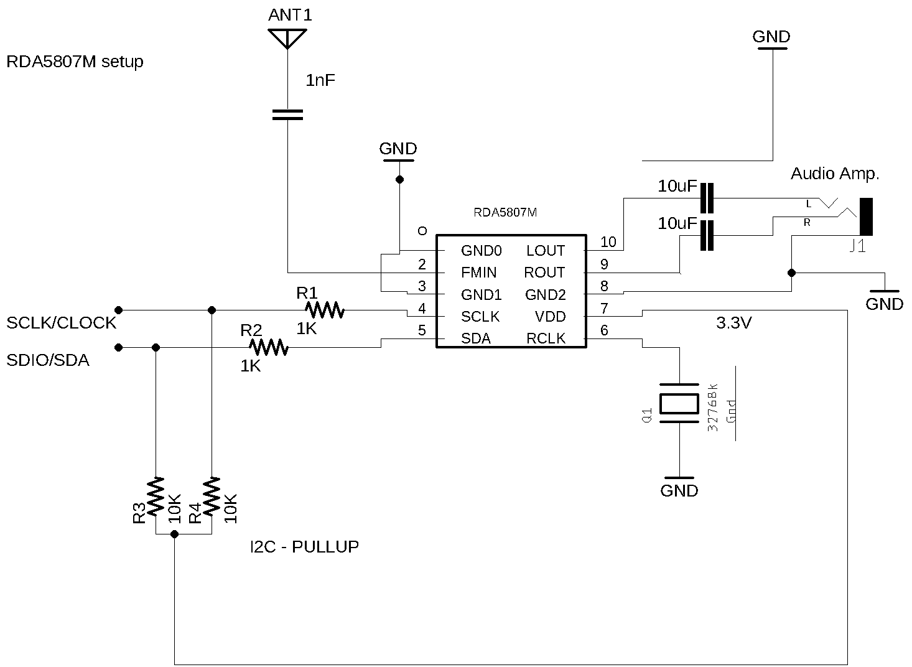

### RDA5807FP standalone IC setup 

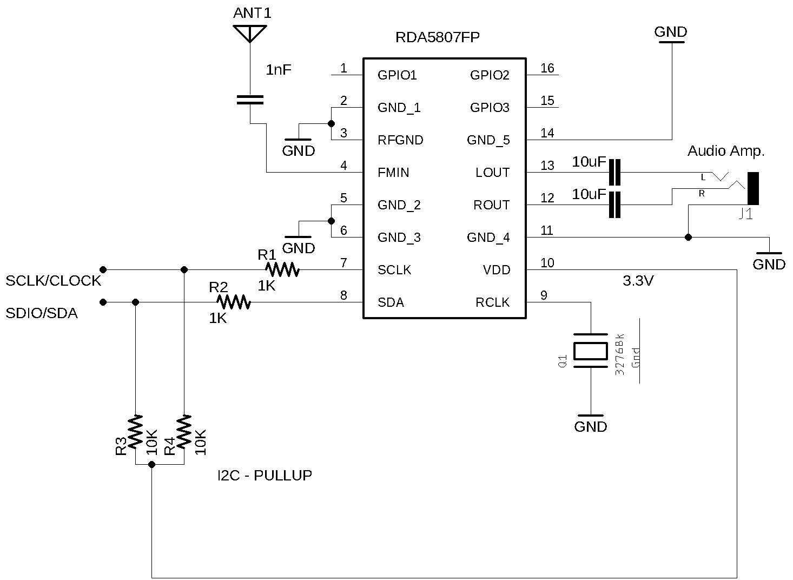

### Basic circuit (examples  RDA5807_00_CIRCUIT_TEST and RDA5807_01_SERIAL_MONITOR)

### TFT Display (example RDA5807_02_TFT_display)

Arduino UNO, Nano or other based on Atmega328 and SPI TFT ST7735 1.8" wireup

| Device name       | Device Pin / Description  |  Arduino Pin  |
| ----------------  | --------------------      | ------------  |
| Display TFT       |                           |               |
|                   | RST (RESET)               |      8        |
|                   | RS  or DC                 |      9        |
|                   | CS  or SS                 |     10        |
|                   | SDI                       |     11        |
|                   | CLK                       |     13        |
|     RDA5807       |                           |               |
|                   | VCC                       |     3.3V      | 
|                   | SDIO (pin 8)              |     A4        |
|                   | SCLK (pin 7)              |     A5        |
|     Buttons       |                           |               |
|                   | Volume Up                 |      4        |
|                   | Volume Down               |      5        |
|                   | Stereo/Mono               |      6        |
|                   | RDS ON/off                |      7        |
|                   | SEEK (encoder button)     |     A0/14     |
|    Encoder        |                           |               |
|                   | A                         |       2       |
|                   | B                         |       3       |

### Attiny84 

#### RDA5807 breakout, ATtiny84, Encoder and Buttons  wireup  

 

| RDA5807 pin     | Attiny84 REF pin | Physical pin  | 
| ----------------| -----------------| ------------- | 
| SEEK_UP         |     3            |    10         | 
| SEEK_DOWN       |     5            |     8         |
| ENCODER_PIN_A   |     0            |    13         |
| ENCODER_PIN_B   |     1            |    12         |  
| SDIO / SDA      |     SDA          |     7         |
| SCLK / CLK      |     SCL          |     9         |

## Attiny85 

### ATtiny85 and RDA5807 wireup  

| RDA5807 pin      | Attiny85 REF pin | Physical pin | 
| ----------------| -----------------| ------------- | 
| SEEK_UP         |     PB1          |     6         | 
| SEEK_DOWN       |     PB4          |     3         |
| SDIO / SDA      |     SDA          |     5         |
| SCLK / CLK      |     SCL          |     7         |
   

### Arduino Nano and NOKIA5110 schematic

#### RDA5807 breakout, Arduino Nano and Nokia 5110 display wireup

| Device name               | Nokia 5110                |  Arduino      |
| --------------------------| --------------------      | ------------  |
| NOKIA 5110                | Pin function              |  Nano Pin     |
|                           | (1) RST (RESET)           |     8         |
|                           | (2) CE or CS              |     9         |
|                           | (3) DC or DO              |    10         |
|                           | (4) DIN or DI or MOSI     |    11         |
|                           | (5) CLK                   |    13         |
|                           | (6) VCC  (3V-5V)          |    +VCC       |
|                           | (7) BL/DL/LIGHT           |    +VCC       |
|                           | (8) GND                   |    GND        |
| --------------------------| ------------------------- | --------------|
| RDA5807                   |       Pin Function        |               | 
|                           | VCC                       |   3.3V        | 
|                           | SDIO (pin 8)              |     A4        |
|                           | SCLK (pin 7)              |     A5        |
| --------------------------| --------------------------| --------------|
| Buttons                   |                           |               |
|                           | Volume Up                 |      4        |
|                           | Volume Down               |      5        |
|                           | Stereo/Mono               |      6        |
|                           | RDS ON/off                |      7        |
|                           | SEEK (encoder button)     |     A0/14     |
| --------------------------| --------------------------|---------------| 
| Encoder                   |                           |               |
|                           | A                         |       2       |
|                           | B                         |       3       |

 

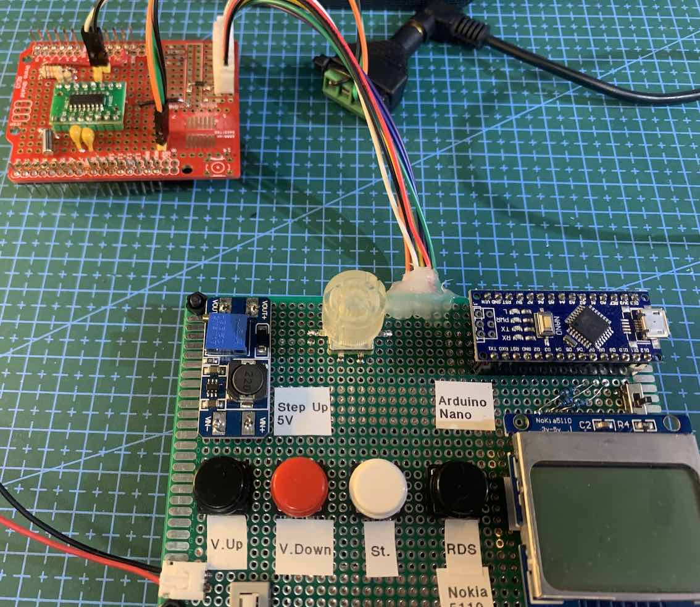

### Arduino Nano and LCD 16x02 

#### Arduino UNO, Nano or Pro mini wireup

| Device name               | Device Pin / Description  |  Arduino Pin  |
| --------------------------| --------------------      | ------------  |
|    LCD 16x2 or 20x4       |                           |               |
|                           | D4                        |     D7        |
|                           | D5                        |     D6        |
|                           | D6                        |     D5        |
|                           | D7                        |     D4        |
|                           | RS                        |     D12       |
|                           | E/ENA                     |     D13       |
|                           | RW & VSS & K (16)         |    GND        |
|                           | A (15) & VDD              |    +Vcc       |
| --------------------------| ------------------------- | --------------|
| RDA5807                   |                           |               | 
|                           | SDIO (pin 8)              |     A4        |
|                           | SCLK (pin 7)              |     A5        |
| --------------------------| --------------------------| --------------|
| Buttons                   |                           |               |
|                           | Volume Up                 |      8        |
|                           | Volume Down               |      9        |
|                           | Stereo/Mono               |     10        |
|                           | RDS ON/off                |     11        |
|                           | SEEK (encoder button)     |     D14/A0    |
| --------------------------| --------------------------|---------------| 
| Encoder                   |                           |               |
|                           | A                         |       2       |
|                           | B                         |       3       |

### ESP32 and LCD 16x02 

 

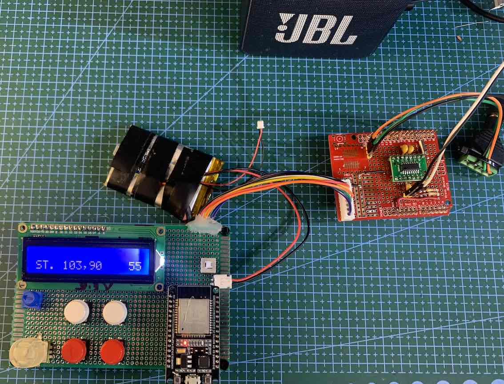

### Arduino UNO and display module TM1638

 

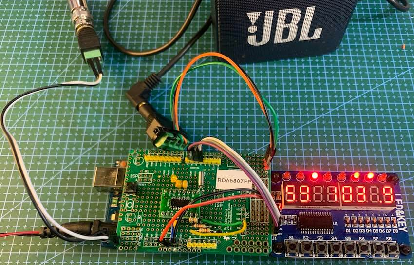

### I2S and RDA5807FP Setup 

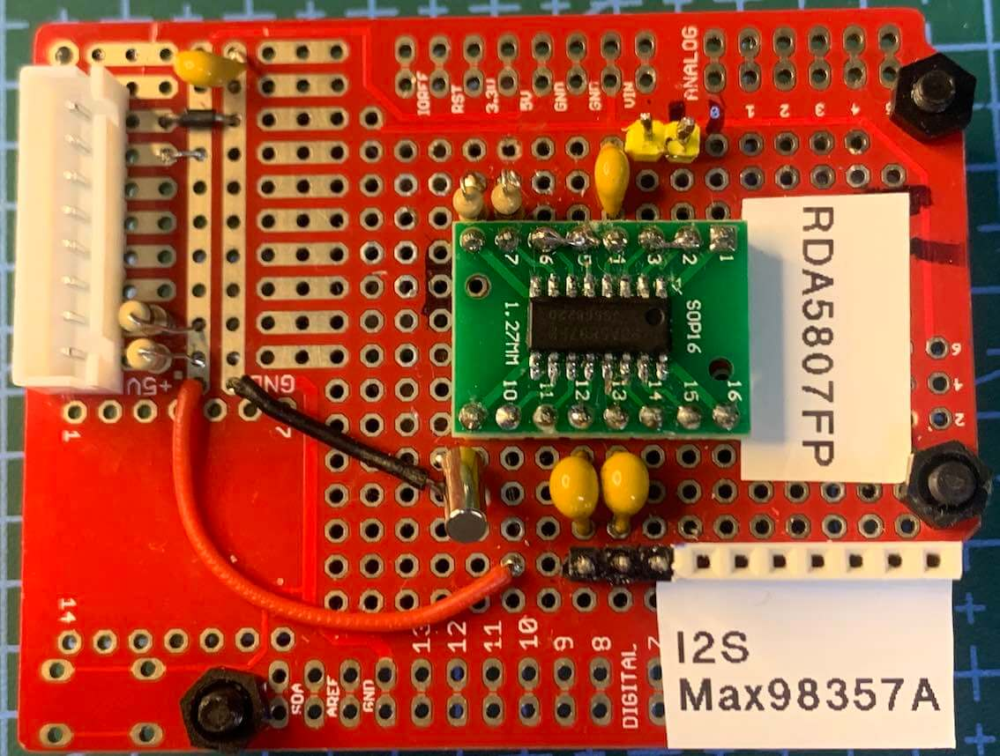

### OLED I2C DISPLAY AND ARDUINO NANO SETUP

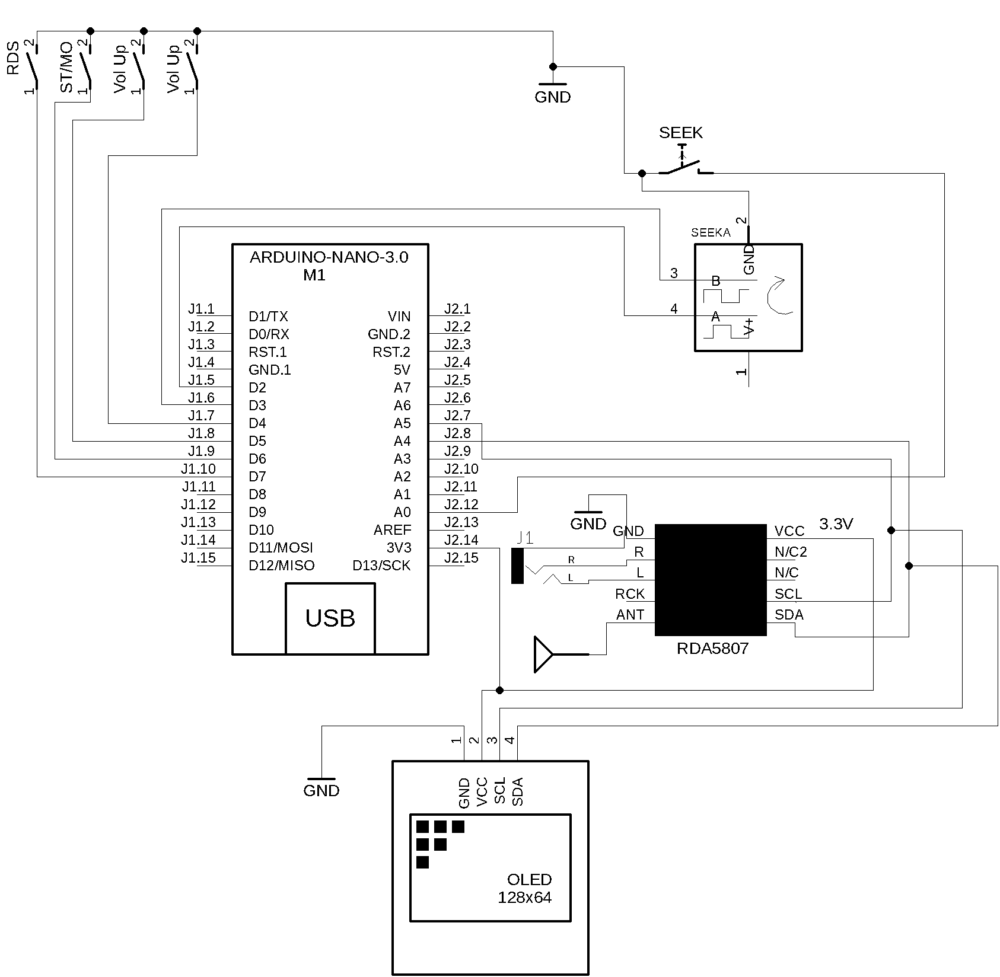

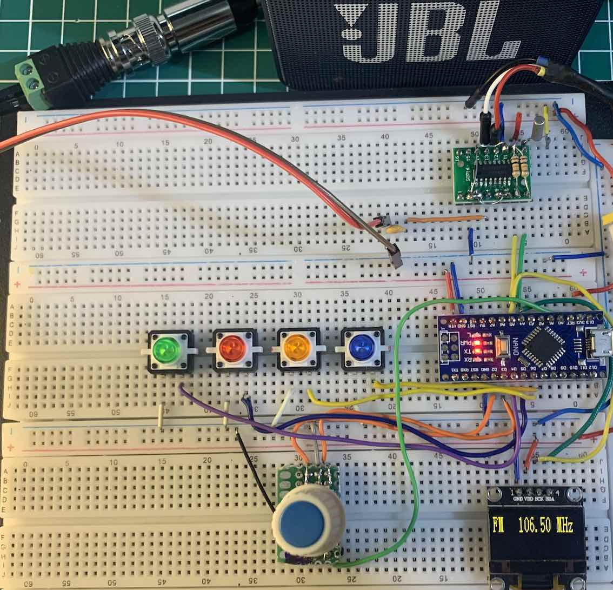

## Vídeos about this Library and projects with RDA5807

* [FM RECEIVER AND I2S DIGITAL AUDIO WITH RDA5807FP AND MAX98357A](https://youtu.be/07017sfMYdY)
* [FM receiver with RDA5807, Arduino UNO and TM1638 seven-segment module](https://youtu.be/I7-fCKPDF4Y)
* [FM  / RDS receiver with RDA5807FP, ESP32  and LCD16x02](https://youtu.be/HgMEgd74SUk)
* [FM / RDS receiver with RDA5807, Arduino Nano and Nokia 5110 display](https://youtu.be/jInacTWoF9Y)
* [FM Receiver with PU2CLR RDA5807 Arduino Library and Nokia 5110](https://youtu.be/ZcgJT7MQdQc)
* [FM Receiver with PU2CLR RDA5807 Arduino Library - RDS/RBDS first test](https://youtu.be/PZsbqieeYns)
* [FM Receiver with RDA5807 Arduino Library by PU2CLR](https://youtu.be/eLWEWEjxM8U)
* [MINIMALIST RECEIVER WITH RDA5807 ARDUINO LIBRARY](https://youtu.be/C-wlpbgniLY)

